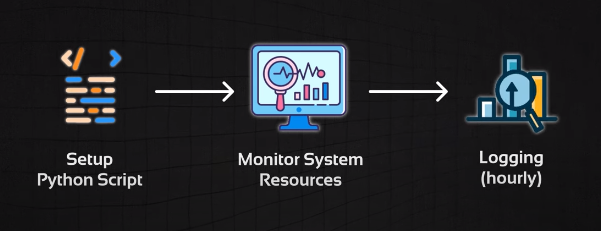

# System Resource Monitoring Script

- This project objective is to develop a Python Script that monitors local system resources (CPU usage, memory usage and disk usage) and logs the info to a file every hour. It aims to provide real-time insights into system performance and resource utilization.

- It automates the exection of the script using 'cron' on Unix-based system.
- Decided to impelement dockerization for simplified deployment.

### Prerequisites
- Have Python 3.9 or higher installed
- Have Docker installed

### Installation
1. Clone this repo to your local machine 

```bash
git clone https://github.com/your-username/your-repo.git
```
### Usage
1. Run python script:

```bash 
python system_monitor.py
```
2. Verify logs, check the 'system_monitor.log' file. It should contain logged data about CPU, memory and disk usage every hour.

3. Automate Script Execution
- Using 'cron expression' on Unix-based systems.

4. Build Docker image:

```bash
docker build -t system-monitor .
```
5. Run the Docker container:

```bash
docker run -d --name system-monitor system-monitor
```

## To be Continued/Future Implementations:
- Grafana Integration to leverage on features such as visualizing system resource metrics.
- Configure Prometheus to scrape metrics from the Python application.

## Contributing
Contributions are welcome! Please open an issue or submit a pluu request with any improvements or bug fixes.

Enjoy! 